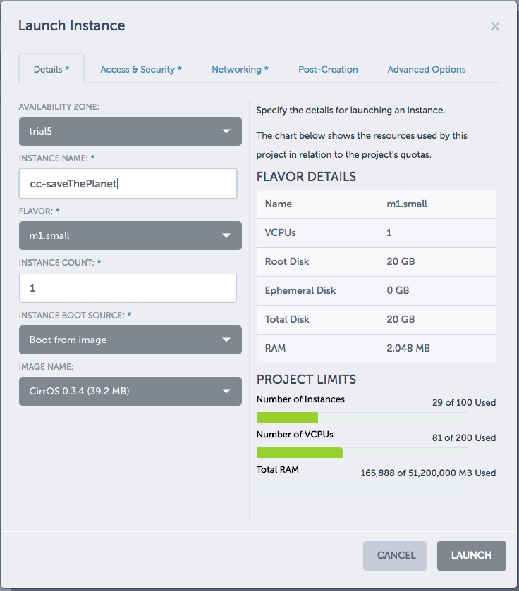

# Metacloud Introduction

### Goals of this lab
In this lab, you will become familiar with the OpenStack UI project, Horizon. We will be using a Metacloud enviroment for the lab. Metacloud is a private cloud offering based on OpenStack that comes with a 99.99% SLA across the entire stack.

It makes use of the underlying unmodified OpenStack APIs. For the purpose of these labs, Metalcoud is just being used as a robust highly available OpenStack cloud. 

More information on Metacloud can be found at  
http://www.cisco.com/go/metacloud

We will explore some basic functionality in OpenStack.

####
 Login to Metacloud environment
Point your browser towards https://dashboard-trial5.client.metacloud.net/auth/login/ or an alternate location if specified by the instrcuctor

Login as: lab01 / password

You should see the following:

Click Launch Instance

 * Provide a unique instance name (cc_mytestinstance). Using your intiials can help ensure you have a unique name in the class.
 * Select the <b> m1.small </b> flavor
 * Set instance count to 1
 * Change Instance Boot Source to <b> Boot from image </b>
 * Set Image Name to: <b>CirrOS 0.3.4</b>
 * Notice the project limit and flavor details to the right side
 * Now select the  <b> Access & Security </b> tab at the top

 * Select a keypair. This can be used to restrict access to a running instance so one cannot login with simply the username and password but rather will need a key.
 * Select the default security group
 * Now select the <b> Networking </b> tab

 * Click the <b>+</b> next to lab-network so that this instance is launched on the private network, lab-net. 
 * Note: In OpenStack with Neutron netorking, it isn't possible to put a VM directly on a public network. To communicate with it, one must put the VM on a private network then attach a floating IP to the instance.
 * Click <b> Launch </b>
 
Explore Instance
 * You will be taken to the Instances page displaying all running virtual machines within the project. Look to see if your instance is running!
 * Click the name of the instance.
 * Explore the various tabs at the top: Overview, Log, Console, Action Log
 * Select the <b> Console </b> tab and then right click >> open in new tab on "Click here to show only console"
 * Login to the instance using the credentials in the display (cirross/cubswin:) This has actually been the default password for Cirros for quite a while!
 * Close this tab and go to the other Metacloud tab.
 * Click the <b> Instances </b> link at the left. 
 
 * Click the arrow to the left of your instance to reveal some detailed statistics about the VM. 
 * Click the arrow at the far right of your instance and familiarize yourself with some of the options available for this running instance.

We have just spun up an instance examined it! Take some time to click around and explore some other options. OpenStack is powered by a rich set of APIs which can be accessed a number of different ways. In this lab, we accessed the APIs using the Horizon UI dashboard. You can also interact diectly with the API via curl or even through a CLI interface.

For the remaining labs, terraform will be used to interact with the underlying OpenStack APIs. This allows us to interact with the cloud in a predictable, reliable, and rapid manner compared to clicking in a web interface.

Cleanup Time!
 * Please delete/terminate your instance when you are finished.
