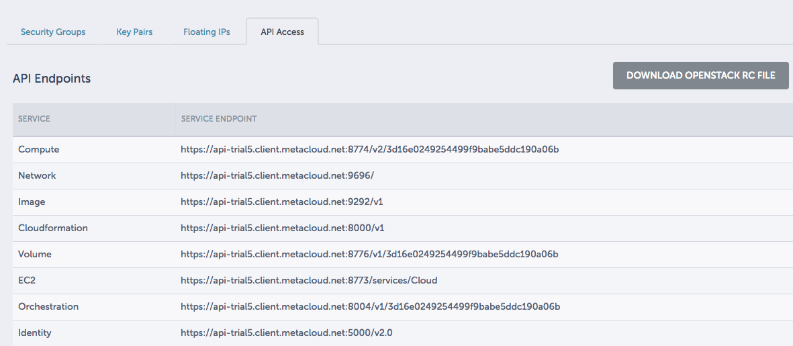

# Environment Setup

In this lab you have the option of using one of our VMs that has all of the tools necessary for you to execute the commands for this lab.  You can either use these machines or you can set up your workstation to be able to execute locally. 

## Using the Lab Machines

The instructor will give you a login to log in to the machines and all installation work can be done there. 

```
ssh <font color="red"><username></font>@<ip>
```
The Password is ```Cisco.123```

If you chose you can set up your own environment and run the lab from your laptop. 

## 1. Access the Cloud

Once you have the prerequisites installed in the appendix below or are using the lab machine we now need to set up access to the OpenStack cloud.  

## 2. Setup the OpenStack environment variables

You should be able to log into the openstack cluster with user name ```lab01``` and password: ```ri3Ci!Wa```

Set the following in your ```~/.profile``` file: 

```
export OS_AUTH_URL=<Metacloud>
export OS_TENANT_ID=<Tenant ID>
export OS_TENANT_NAME=<Tenant Name>
export OS_USERNAME="lab01"
export OS_PASSWORD="ri3Ci!Wa"
export OS_REGION_NAME="RegionOne"
export OS_VOLUME_API_VERSION=1
export OS_IMAGE_API_VERSION=1
export OS_IMAGE_URL=<Image URL>
```

To get these variables you may need to log into Metacloud and look at Access & Security in your project and then check the API Access screen. 



  * HINT: Fo the AUTH_URL look at the Identity section in the API list 
  * The tenant id can be accessed from the Network >> Network >> Name of Network page in the Horizon dashboard
  * The tenant name will be the same as the openstack project you are working on
  * Be sure to replace all variables that need to be set (contained betwen "< >")
  * Syntax-wise, there should be no remaining < or  >'s

Source this file: 

```
. ~/.profile
```
Now these variables will be active anytime you log into the cluster. 

Test that it works: 

```
openstack server list
```

### Caveats for Liberty OpenStack builds
The following exceptions are noted for using Liberty with Terraform.  The file that is downloaded from the Horizon dashboard will need a few other environment variables set:

```
export OS_AUTH_URL=https://<given url>:5000/v3
export OS_DOMAIN_NAME="<domain name>"
```

## 3. Get Source Files

```
git clone https://github.com/CiscoCloud/k8sclass.git
```

You should now have everything you need to do the first lab and install your kubernetes cluster!

You can now move on to the [Installation Lab](https://github.com/CiscoCloud/k8sclass/blob/master/01-Install/README.md)


## Appendix: Setting your own Environment

If you decide to do this on your own laptop you will need the following installed: 

* Terraform
* OpenStack Client
* Git
* Cloudflare Binaries
* Kubectl binary (1.4)

If you have issues with any of these tools, check to make sure you are at a current version.  

### Setting up environment on Ubuntu

The following instructions are for setting up the lab environment: 

#### Create Users

```
for i in $(seq 9); do useradd -m -G sudo -p $(openssl passwd -1 Cisco.123) -s /bin/bash user0$i; done
```

#### Get OpenStack Client

```
apt-get update
apt install python-pip
pip install --upgrade pip
pip install python-openstackclient
```
_Note:_ when the python-openstackclient is installed it installs the other OpenStack clients, but doesn't install the clients for them, so you can't run commands like ```neutron```.  Instead the commands all run through running the ```openstack``` command.  

#### Get Terraform 

```
wget https://releases.hashicorp.com/terraform/0.7.9/terraform_0.7.9_linux_amd64.zip
apt-get install -y unzip
mv terraform /usr/local/bin/
```

#### Get Cloudflare Binaries

```
wget https://pkg.cfssl.org/R1.2/cfssl_linux-amd64
chmod +x cfssl_linux-amd64
sudo mv cfssl_linux-amd64 /usr/local/bin/cfssl
```

```
wget https://pkg.cfssl.org/R1.2/cfssljson_linux-amd64
chmod +x cfssljson_linux-amd64
sudo mv cfssljson_linux-amd64 /usr/local/bin/cfssljson
```

#### Get Kubernetes Binary

```
wget https://storage.googleapis.com/kubernetes-release/release/v1.4.0/bin/linux/amd64/kubectl
chmod +x kubectl
sudo mv kubectl /usr/local/bin
```

When you have these components you are now ready to setup your environment as specified in 
